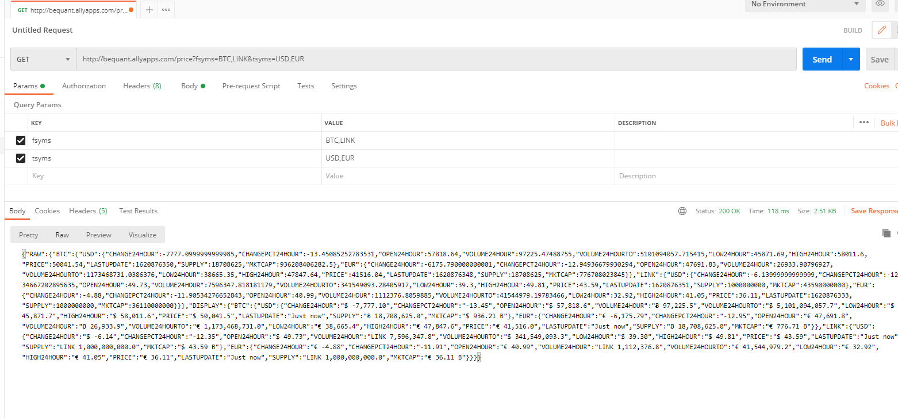
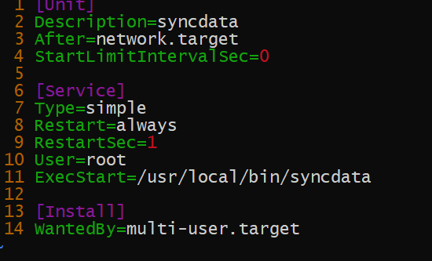
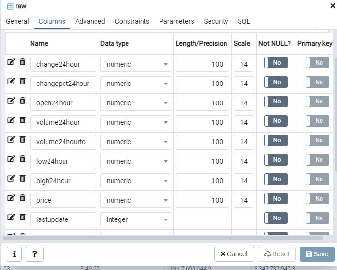
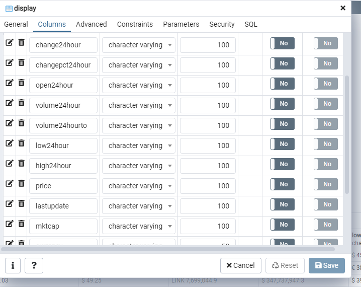
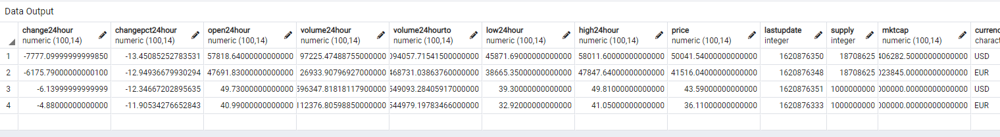
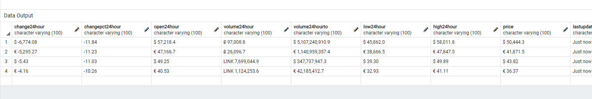
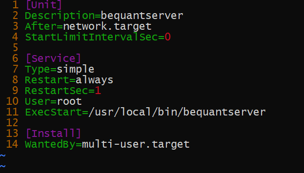
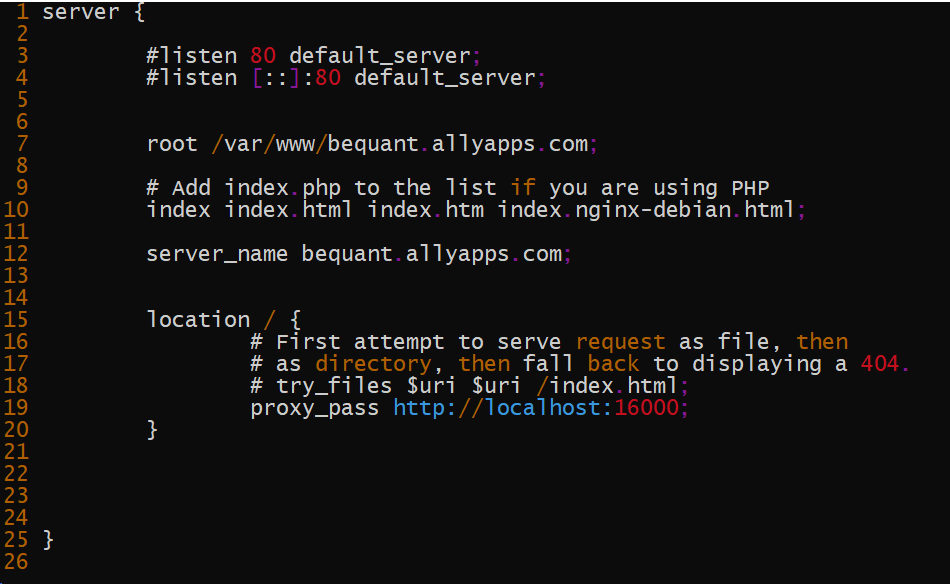

# Bequant
Service that collect data from cryptocompare.com using its API and stores it in a database (PostgreSQL))

## Installation

Setup the database
- Open PgAdmin
- Create a new dabase called **bequant**
- Import **bequant.sql**
- Update config.json with your db credential

Run the following command
```bash
git clone https://github.com/joycezemitchell/bequant.git 
go build -o bequantserver server.go
go build -o sychdata synch.go
```

To test it in your local machine, run the following commands in 2 separate terminals:

For syching and grabbing data from cryptocompare.com, run the following:

```bash
go run synch.go
```

or

```bash
./sychdata
```


For running the server:

```bash
go run server.go
```

or

```bash
./bequantserver
```

You can go to http://localhost:16000 to test it in your local machine


## Database Configuration
Open configration.json and update the following with your credential

```bash
{
    "host":"xxxx",
    "port":5432,
    "user":"xxxx",
    "password":"xxxx",
    "dbname":"bequant"
}
```


## Usage
At the moment it only supports 
- BTC
- LINK
- USD
- EUR

I have set it up on my DigitalOcean dev environment  server so you run some test.

Grab all BTC and LINK with USD and EUR currencies
```sh
http://bequant.allyapps.com/price?fsyms=BTC,LINK&tsyms=USD,EUR
```
Grab all BTC and LINK with USD currency only
```sh
http://bequant.allyapps.com/price?fsyms=BTC,LINK&tsyms=USD
```
Grab all BTC with EUR currencies
```sh
http://bequant.allyapps.com/price?fsyms=BTC&tsyms=EUR
```

Grab all LINK with USD currency 
```sh
http://bequant.allyapps.com/price?fsyms=LINK&tsyms=USD
```

Sample Postman output



## Grabbing new data from cryptocompare.com
Running **synch.go** will get/collect data from cryptocompare.com using its API and stores it in a database. This need to be running in the background and run as a daemon service. 

At the moment I have stop this service as it will run every 2 minutes and will max out my test server environment.
Please let me know if you need me to start this service.

Here is a screenshot of a the daemnon configuration




## Database Structure
I used **PostgreSql** as a backend database and created 2 tables called **raw** and **display**

(Please check **bequant.sql** for complete db structure)





Sample database content





# Server Sturcture
Currently the **bequant** server is running as a daemon and it is behind a proxy server (nginx)
Here is the following command to start the server:
```bash
systemctl start bequantserver
```


Here is the configuration of the server


Here is the nginx configuration



